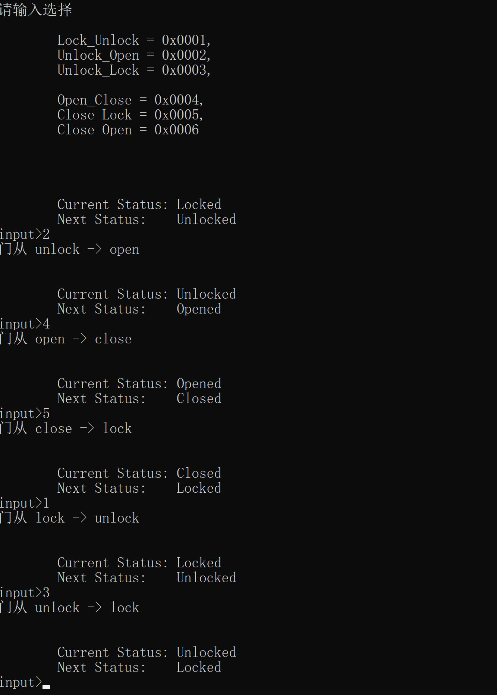

# FiniteStateMachine

> 有限状态机
>
> 什么是状态机可以参考:
>
> https://zh.wikipedia.org/zh-cn/%E6%9C%89%E9%99%90%E7%8A%B6%E6%80%81%E6%9C%BA
>
> https://www.eet-china.com/mp/a43466.html

## Why

> 为什么要学习状态机呢?
>
> 首先明白状态机本身是一种算法，类似设计模式的东西。在面向对象中，学习设计模式/思想远比学习别人封装的辅助函数或者API怎么使用重要的多。当然抽象的东西对于新手及其不友好，那也得硬着头皮啃！！

> 做过控制流混淆的对state machine肯定比较熟悉了。状态机平时我们写代码已经在使用了，不过没有发现罢了。就行被抛出去的一块石头，飞向空中已经处于重力场却不知道。

## What

> 这里以 开门，关门，上锁，解锁四个步骤简单学习下状态机。
>
> Credits to the above mention post,thanks a ton!

## Demo

> 根据状态机的定义  需要有状态，事件，行为等几个重要因素。
>
> 这里事件，我选择由用户输入，触发事件后执行某个行为Action，然后变更状态。

> 我觉得比较重要的是   理清楚状态与状态之间的关系。比如上面的  Locked和Opened 她两的下一个状态是可以确定的，打开的门下一个状态只有关闭了，上锁的门（默认是关闭的）只有解锁。
>
> 然后把这种关系尽量往面向对象上去套用，慢慢理解   (: 被自己菜哭 :)

